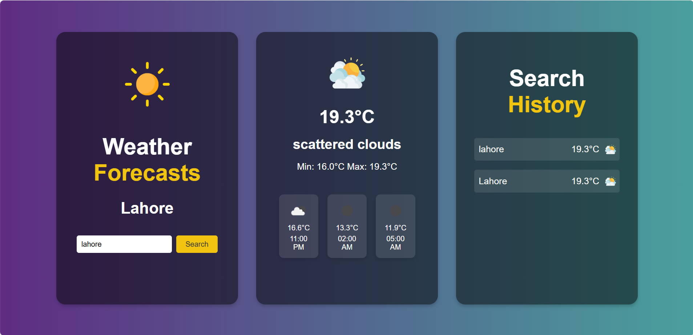

# Weather Forecast App

A **responsive web application** that provides **real-time weather updates** and **multi-day forecasts** using live weather APIs. The app features a **dynamic UI**, location-based forecasting, and robust error handling for an intuitive and accurate weather experience.


## Screenshot




## ✨ Features

* **Real-time weather updates**
* **Multi-day forecasts** with hourly breakdown
* **Location-based tracking**
* **Dynamic and responsive UI** for desktop and mobile
* **Error handling** for invalid locations or API issues
* **Search history** to quickly access previously searched cities

---

## 🛠 Installation / Setup

1. **Clone the repository:**

   ```bash
   git clone https://github.com/nimra-maqbool/Weather-Forecast-App.git
   ```

2. **Navigate to the project directory:**

   ```bash
   cd Weather-Forecast-App
   ```

3. **Open the application:**

   * Open `index.html` in a browser
   * Or run a local server (e.g., [VS Code Live Server](https://marketplace.visualstudio.com/items?itemName=ritwickdey.LiveServer)) for full functionality

---

## Usage

* Enter a **city name** in the search box or **enable location services** to get local weather.
* View **current weather** and **multi-day forecasts**.
* Use the **search history** panel to quickly access previous queries.
* Refresh the page to get the **latest updates** from the weather API.

---

## Folder Structure

```
Weather-Forecast-App/
├─ images/
│  ├─ Weather-forecast.png
│  ├─ clear.png
│  ├─ clouds.png
│  └─ ...other images
├─ index.html
├─ script.js
├─ README.md
└─ LICENSE
```

---

## Notes

* Ensure your **API key** (if required) is correctly configured in `script.js`.
* The app is fully **responsive**, so it works on both **desktop** and **mobile devices**.
